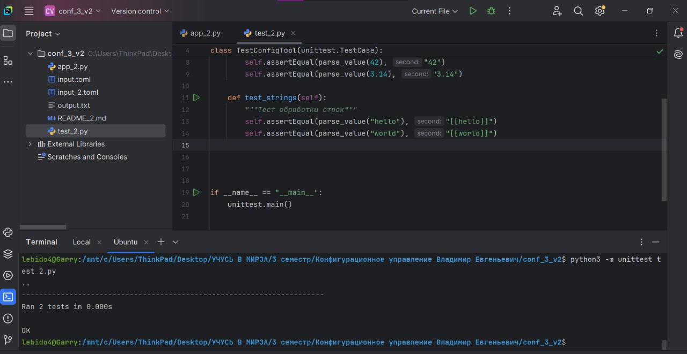

# Конвертер конфигурационных файлов

Этот проект представляет собой инструмент командной строки, предназначенный для преобразования конфигурационных файлов в формате TOML в собственный учебный конфигурационный язык. Программа поддерживает обработку строк, чисел, словарей, а также выражений, выполняемых на этапе трансляции.

---

## Возможности

- Поддержка чисел, строк, и вложенных словарей.
- Преобразование выражений, таких как `$+ x y$`, на этапе трансляции.
- Обработка однострочных и многострочных комментариев.
- Автоматическое выявление ошибок в синтаксисе входного TOML-файла.

---

## Учебный конфигурационный язык: Ключевые элементы

### Комментарии

- **Однострочные комментарии**:
  ```text
  -- Это комментарий

- **Многострочные комментарии**:

=begin
Многострочный
комментарий
=end```

Словари
Словари задаются в формате:

{
  ключ : значение,
  ключ : значение,
  ...
}

###Константные выражения

Сложение: $+ x y$
Вычитание: $- x y$
Умножение: $* x y$
Возведение в степень: $pow x y$

###Использование
Для запуска программы выполните следующую команду в терминале:
```
python app.py input.toml output.txt
```

###Ввод
```
x = 10
y = 20
z = "$+ x y$"

[server]
host = "127.0.0.1"
port = 8080
```

###Результат

```
server is {
  host : [[192.168.1.1]],
  port : 80,
}
security is {
  https : [[true]],
}
```


###Тестирование 

